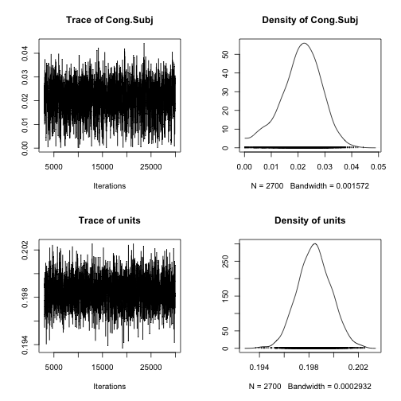

Commentary & analysis of http://jeffrouder.blogspot.com/2016/08/where-bayes-and-classical-inference.html by Rouder & Haaf
=========================================================================================================================

by Roger Levy (rplevy@mit.edu)

This is a brief summary of some computational analysis of the Stroop dataset presented by Rouder & Haaf.  Original `.Rmd` code is in `haaf-rouder-commentary.Rmd`.


Fitting a linear mixed effects model using `lme4` we see that the (restricted) maximum likelihood estimate of the standard deviation of inter-subject differences in the Congruity effect (your $\eta$) is just a bit under 23ms (this is the Subj.1 random slope for Cong). A likelihood ratio test for the presence of inter-subject differences gives a reasonably similar result as the $F$-test did: rejection of the null at $p=0.036$.  (Note that the likelihood ratio test for the presence of a random effect is generally viewed as being too conservative most of the time -- e.g., Stram & Lee, 1994.)


```
## Loading required package: Matrix
```

```
## Loading required package: methods
```


```
##  Length   Class    Mode 
##       1 lmerMod      S4
```

```
## Error in UseMethod("anova"): no applicable method for 'anova' applied to an object of class "lmerMod"
```

Next, in order to get a sense of what the marginal data likelihood as a function of $\eta$ looks like, I estimated the posterior distribution on $\eta$ using `MCMCglmm`, putting a diffuse prior on $\eta$ using the method of parameter expansion.  (It should be possible to compute the likelihood conditioned on a value of $\eta$ analytically, as described e.g. in Pinheiro & Bates 2000, section 2.2.1-2.2.5, but that would be a lot more coding effort!)  The first row of graphs below presents the sampled posterior estimate for $\eta$.  Observe that the highest posterior density matches the `lme4` results above well.  As a sanity check, the second row presents the sampled posterior estimate for the standard deviation of observation-level residual error $\sigma$; this also matches the `lme4` results.  (Note that in both the `lme4` and `MCMCglmm` implementations, I intentionally excluded the possibility of correlations between the random intercept and random slope, to keep the inferential question focused strictly on the strength of evidence for a non-zero $\eta$.)


```
## Loading required package: coda
```

```
## Loading required package: ape
```



The posterior density on $\eta$ is six to ten times as high at the maximum as it is in the vicinity of zero (the precise ratio varies from run to run, mostly because not all that many samples make it right up close to zero).  Because the prior in this fit was diffuse, the posterior mostly reflects the likelihood ratio.  This interpretation comports reasonably well with the `lme4` results: $\sqrt{6}=2.44$ is not terribly far off from the difference in log likelihood between the $\eta=0$ and unconstrained-$\eta$ models fitted in `lme4`.

Finally, note that there is a large region of $\eta$ whose posterior probability density is higher than the posterior density around $\eta=0$.  Roughly speaking, let's say that this is true in the region $0<\eta<0.35$.  Based on my calculations, your truncated inverse-gamma prior on $\eta$ puts a mass of about 0.3 in that region (exclusively in the region $0.25<\eta<0.35$).  It seems to me that we should thus be able to upper-bound the Bayes Factor in favor of $\eta=0$ as $\frac{1}{0.3}$: at least 30% of the prior probability mass in the variation alternative model is on values of $\eta$ that have data likelihood at least as high as 100% of the prior probability mass of the constant Stroop effect model.  (And this is a generous upper bound given the posterior density on $\eta$ seen in the figure above!) This reasoning is, of course, at considerable odds with the results of the analysis of the Bayes Factor favoring $\eta=0$ as high as $10^{60}$.
